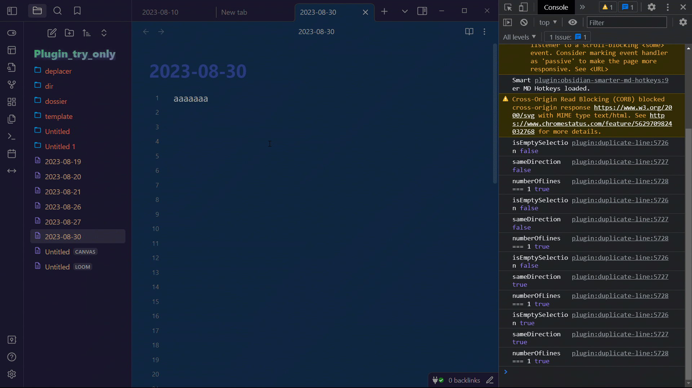

# duplicate-line(s) / Add next occurence

- Select next occurrence and all occurences updated to work on every selection (if no selection word at cursor position)
- new feature to show number of occurences on selection in status bar (settings color size)
Remember: All features can be switched on/off in settings
[LastFeaturesDemo](https://youtu.be/gJmA36TX7GU)
  
this plugin was at first a simple plugin to duplicate lines up and down  
then I added more options. Some options were greatly inspired by obsidian-tweaks. But I fixed a lot of bugs.  
I tried to make some pull request on this repo but no answer. But thanks to him for many things.  
  
All commands (can be disabled in settings):  
Duplicate Line Down, (recommanded shortcut shift alt ↓)  
Duplicate Line Up, (recommanded shortcut shift alt ↑)  
Duplicate Selection Down, (recommanded shortcut ctrl shift ↓)  
Duplicate Selection Up, (recommanded shortcut ctrl shift ↑)  
Duplicate Selection Right, (recommanded shortcut ctrl shift →)  
Move Right, (recommanded shortcut alt →)  
Move Left, (recommanded shortcut alt ←)  
Add next occurence", (ctrl D)  
Select all occurences, (ctrl shift L)  
Duplicate Selection Right/Line Down (feature request). When no selection duplicate line down, when selection duplicate right.  
  
Selection can be multiline and multicursors  
if no selection the word before or under cursor is selected, when using selection operations  
if no selection, the whole line is used, when using duplicate operations. if selection multiline then duplicate   multiline... it's quite intuitive, make some tries  
  
All commands can be enabled/disabled in settings.  
  

## Development (Add this to your README)

Automate the development and publication processes on github, including releases. You are supposed to git clone your plugin out of the vault and set the right path in the .env file (1 for your trying vault, 1 for the real vault).  
  
If you want more options like sass, check out other branches     
  
### Environment Setup
  
- **Development in the plugins folder of your vault:**
  - Set the `REAL` variable to `-1` in the `.env` file. Or delete the file. Run the usual npm commands.

- **Development outside the vault:**
  - If your plugin's source code is outside the vault, the necessary files will be automatically copied to the targeted vault. Set the paths in the .env file. Use TestVault for the development vault and RealVault to simulate production.  
  
- **other steps:**   
  - You can then do `npm run version` to update the version and do the push of the changed files (package, manifest, version). Prompts will guide you.  
  
  - You can then do `npm run release` to create the release. Few seconds later you can see the created release in the GitHub releases.  

### Available Commands
  
*I recommend a `npm run start` then `npm run bacp` then `npm run version` then `npm run release`. Super fast and easy.*  
  
- **`npm run dev` and `npm start`**: For development. 
  `npm start` opens Visual Studio Code, runs `npm install`, and then `npm run dev`  
  
- **`npm run build`**: Builds the project in the folder containing the source code.  
  
- **`npm run real`**: Equivalent to a traditional installation of the plugin in your REAL vault.  
  
- **`npm run bacp`** & **`npm run acp`**: `b` stands for build, and `acp` stands for add, commit, push. You will be prompted for the commit message. 
  
- **`npm run version`**: Asks for the type of version update, modifies the relevant files, and then performs an add, commit, push.  
  
- **`npm run release`**: Asks for the release title, creates the release. This command works with the configurations in the `.github` folder. The release title can be multiline by using `\n`.