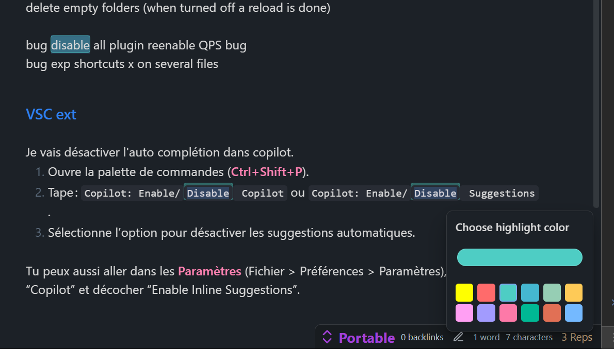
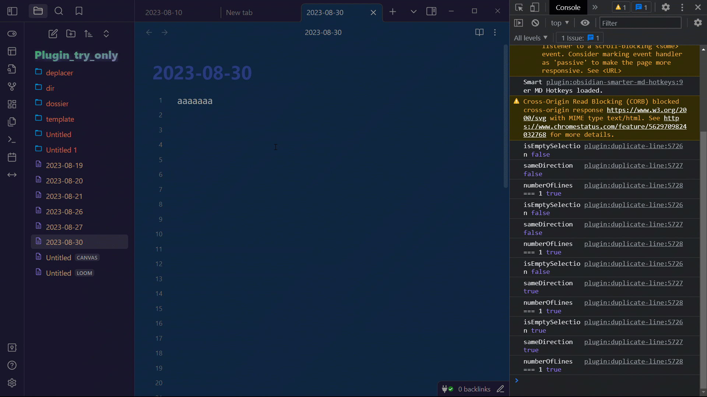

# duplicate-line(s) / Add next occurence

- Select next occurrence and all occurences updated to work on every selection (if no selection word at cursor position)
- Smart occurrence counter in status bar with interactive features
- Customizable highlight colors for better visibility
- Case sensitivity toggle for precise text matching
  Remember: All features can be switched on/off in settings
  [LastFeaturesDemo](https://youtu.be/gJmA36TX7GU)

this plugin was at first a simple plugin to duplicate lines up and down  
then I added more options. Some options were greatly inspired by obsidian-tweaks. But I fixed a lot of bugs.  
I tried to make some pull request on this repo but no answer. But thanks to him for many things.

All commands (can be disabled in settings):  
Duplicate Line Down, (recommanded shortcut shift alt ↓)  
Duplicate Line Up, (recommanded shortcut shift alt ↑)  
Duplicate Selection Down, (recommanded shortcut ctrl shift ↓)  
Duplicate Selection Up, (recommanded shortcut ctrl shift ↑)  
Duplicate Selection Right, (recommanded shortcut ctrl shift →)  
Move Right, (recommanded shortcut alt →)  
Move Left, (recommanded shortcut alt ←)  
Add next occurence", (ctrl D)  
Select all occurences, (ctrl shift L)  
Duplicate Selection Right/Line Down (feature request). When no selection duplicate line down, when selection duplicate right.

Selection can be multiline and multicursors  
if no selection the word before or under cursor is selected, when using selection operations  
if no selection, the whole line is used, when using duplicate operations. if selection multiline then duplicate multiline... it's quite intuitive, make some tries

All commands can be enabled/disabled in settings.

## ✨ New Features

### 📊 Smart Status Bar Counter

When you select text, the status bar displays the number of occurrences found in the document:

- Shows "1 Rep", "2 Reps", "3 Reps", etc.
- Includes case sensitivity indicator: "(Aa)" for case-sensitive, no indicator for case-insensitive
- **Interactive**: Click on the counter to access quick options

### 🎨 Interactive Status Bar Menu

**Click on the occurrence counter** in the status bar to open a context menu with:

#### 🔄 Case Sensitivity Toggle

- **"Switch to Case sensitive (Aa)"** or **"Switch to Case insensitive (aa)"**
- Instantly updates the occurrence count and highlights
- No need to go to settings - toggle directly from the status bar!
- Example: "disable" vs "Disable" - toggle to match exactly or ignore case

#### 🎨 Quick Color Picker

- **"Change highlight color"** opens a beautiful color picker right where you clicked
- **12 preset colors** for quick selection (yellow, red, teal, blue, green, orange, pink, purple, rose, emerald, coral, sky blue)
- **Custom color picker** for any color you want - perfect for matching your theme
- **Smart positioning** - automatically avoids screen edges and UI elements like consoles
- **Real-time preview** - see changes immediately as you click
- **Auto-save** - your color choice is saved automatically and persists between sessions

### 🌈 Customizable Highlight Colors

- **Occurrence highlighting**: All matching text is highlighted as you type/select
- **Multiple selection highlighting**: When using Ctrl+D or Ctrl+Shift+L, all selections stay the same color
- **Consistent styling**: Same color used for all highlight types
- **Theme-friendly**: Works with both light and dark themes

### ⚙️ Enhanced Settings

- **Highlight color picker** in plugin settings
- **Case sensitivity option** for occurrence matching
- **Toggle highlight feature** on/off
- All settings sync with the status bar menu for seamless experience

## 🎯 Usage Examples

### 📋 Step-by-step Guide

**Prerequisites**: You must first **select some text** to activate the occurrence counter and menu.

1. **Quick case toggle**:

   - Select text (e.g., "disable")
   - Click on "X Reps" in the status bar
   - Choose "Switch to Case sensitive (Aa)" or "Switch to Case insensitive (aa)"

2. **Change highlight colors**:

   - Select text → Click "X Reps" → "Change highlight color"
   - Choose from 12 beautiful preset colors OR use the custom color picker
   - Changes apply instantly!

3. **Multiple selections with consistent colors**:

   - Select text → Ctrl+D to add next occurrence → All selections stay highlighted in your chosen color
   - Use Ctrl+Shift+L to select all occurrences at once

4. **Visual feedback**:
   - See exactly how many occurrences exist before using selection commands
   - Status bar shows "1 Rep", "2 Reps", "3 Reps", etc.

### 🎨 Color Picker in Action

_The beautiful color picker appears right where you click, with 12 preset colors and a custom color selector. Notice how "disable" is highlighted in teal, and the status bar shows "3 Reps" - perfect for knowing exactly what you're working with!_

### 📱 Important Notes

- **Desktop only**: Status bar features work on desktop Obsidian only (mobile doesn't have a status bar)
- **Selection required**: You must select text first to see the occurrence counter
- **Minimum 2 characters**: Very short selections (< 2 chars) won't trigger the counter
- **Real-time updates**: All changes (color, case sensitivity) apply immediately

## Development (Add this to your README)

Automate the development and publication processes on github, including releases. You are supposed to git clone your plugin out of the vault and set the right path in the .env file (1 for your trying vault, 1 for the real vault).

If you want more options like sass, check out other branches

### Environment Setup

- **Development in the plugins folder of your vault:**

  - Set the `REAL` variable to `-1` in the `.env` file. Or delete the file. Run the usual npm commands.

- **Development outside the vault:**
  - If your plugin's source code is outside the vault, the necessary files will be automatically copied to the targeted vault. Set the paths in the .env file. Use TestVault for the development vault and RealVault to simulate production.
- **other steps:**

  - You can then do `npm run version` to update the version and do the push of the changed files (package, manifest, version). Prompts will guide you.

  - You can then do `npm run release` to create the release. Few seconds later you can see the created release in the GitHub releases.

### Available Commands

_I recommend a `npm run start` then `npm run bacp` then `npm run version` then `npm run release`. Super fast and easy._

- **`npm run dev` and `npm start`**: For development.
  `npm start` opens Visual Studio Code, runs `npm install`, and then `npm run dev`
- **`npm run build`**: Builds the project in the folder containing the source code.
- **`npm run real`**: Equivalent to a traditional installation of the plugin in your REAL vault.
- **`npm run bacp`** & **`npm run acp`**: `b` stands for build, and `acp` stands for add, commit, push. You will be prompted for the commit message.
- **`npm run version`**: Asks for the type of version update, modifies the relevant files, and then performs an add, commit, push.
- **`npm run release`**: Asks for the release title, creates the release. This command works with the configurations in the `.github` folder. The release title can be multiline by using `\n`.
